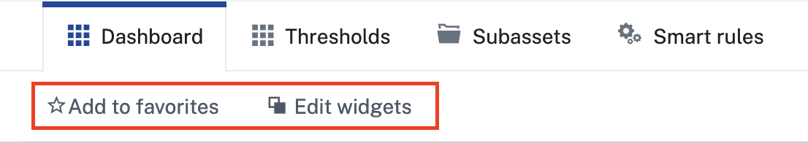

# Action Bar Components



These components use [content-projection](https://styleguide.cumulocity.com/apps/codex/#/getting-started/guides/extension-points/overview#content-projection) to be used inside of the action bar of e.g. the Cockpit app.

All components are provided as [standalone](https://v18.angular.dev/guide/components/importing#standalone-components), which means you need to import them like modules, e.g. 
```typescript
import { ActionBarDatePicker } from './action-bar-datepicker.component';

@NgModule({
  declarations: [...],
  providers: [...],
  imports: [
    ActionBarDatePicker,
  ]
});
```

## Action Bar Datepicker Component

```typescript
<ps-action-bar-datepicker [date]="date" (dateChange)="onDateChanged($event)"></ps-action-bar-datepicker>
```

## Action Bar Dropdown Component

```typescript
<ps-action-bar-dropdown [items]="dropdownItems" (selectionChange)="onDropdownSelectionChanged($event)"></ps-action-bar-dropdown>
```

## Action Bar Reload Component

HTML:
```typescript
<ps-action-bar-reload-button [refreshCallback]="refreshCallback"></ps-action-bar-reload-button>
```

Component:
```typescript
refreshCallback: Promise<void>;

constructor() {
    this.refreshCallback = this.reload.bind(this);
}

private reload(): Promise<void> {
    // do your async stuff here
}
```

## Action Bar Search Component

HTML:
```typescript
<ps-action-bar-search [filter]="{ query: 'has(c8y_Position)' }" (selectionChange)="onSearchChanged($event)" ></ps-action-bar-search>
```