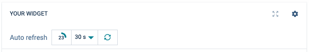
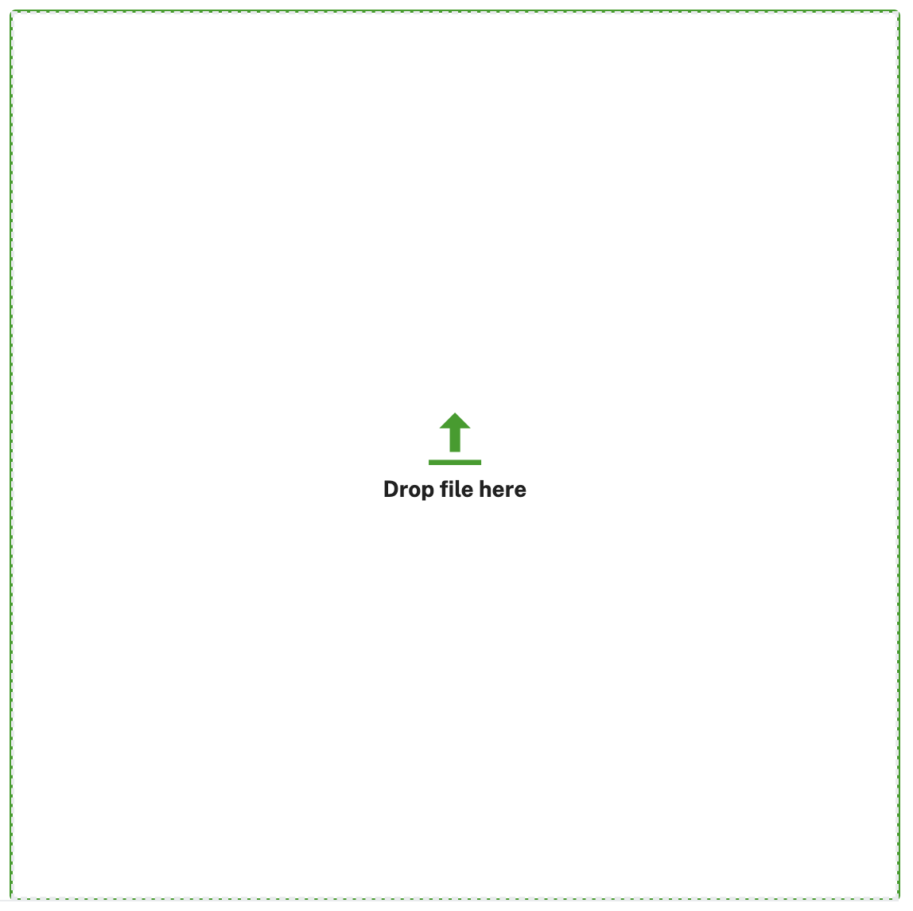

# Components

## Alarm Icon

TODO: Add image here

## Auto Refresh



```HTML
<-- HTML -->
<div class="card-header separator-top separator-bottom sticky-top">
  <div class="fit-w d-flex a-i-center fit-h-20 m-l-auto">
    <ps-auto-refresh
      [isLoading$]="isLoading$"
      [isIntervalToggleEnabled]="true"
      (onCountdownEnded)="refresh()">
    </ps-auto-refresh>
  </div>
</div>
```

```typescript
// Module
@NgModule({
  imports: [PSAutoRefreshComponent]
})
export class MyModule {}

// Component
isLoading$ = new BehaviorSubject<boolean>(false);

refresh() {
  this.isLoading$.next(true);
  this.loadMyData().finally(() => {
    this.isLoading$.next(false);
  });
}
```

## Device Selector Modal


Within your module add the standalone component to the imports:

```typescript
import { ModalModule } from 'ngx-bootstrap/modal';
import { DeviceSelectorModalComponent } from './device-selector-modal.component';

@NgModule({
  declarations: [...],
  providers: [...],
  imports: [
    ModalModule,
    DeviceSelectorModalComponent,
  ]
});
```

In your components code, open it like this:

```typescript
constructor(public inventory: InventoryService, private modalService: BsModalService) {}

openAssignDevicesModal() {
    const modal = this.modalService.show(DeviceSelectorModalComponent, { class: 'modal-lg' });
    modal.content?.closeSubject.subscribe((res) => {
      if (res) {
        this.inventory
          .list({
            pageSize: 2000,
            ids: res.map(iid => iid.id!).join(','),
          })
          .then((res) => {
            // do whatever you want to do with res.data
          });
      }
    });
  }
```

## Image Upload



Within your module add the standalone component to the imports:

```typescript
@NgModule({
  declarations: [...],
  providers: [...],
  imports: [
    ImageUploadComponent
  ]
});
```

In your components HTML, add the following:

```typescript
<image-upload (imageUploaded)="onImageUploaded($event)"></image-upload>
```

## Image Gallery

This component shows multiple images in a gallery carousel using the [Carousel component of ngx-bootstrap](https://valor-software.com/ngx-bootstrap/components/carousel). For the carousel to render correctly, make sure that [Bootstrap 5](https://getbootstrap.com/) is included in your dependencies.

Within your module add the standalone component to the imports:

```typescript
@NgModule({
  declarations: [...],
  providers: [...],
  imports: [
    ImageGalleryComponent
  ]
});
```

In your components HTML, add the following:

```typescript
  <image-gallery [gallery]="gallery" 
  [interval]="5000"
  [noPause]="false"
  [noWrap]="false"
  [showIndicators]="true"
  [pauseOnFocus]="false">
```

All attributes expect the gallery are optional.

* **gallery** is a *GalleryImages* object containing an *images* property with the paths to the images.
* **interval** is the interval in milliseconds for auto changing images. A negative or zero value disables auto changing.
* **noPause** Boolean whether users can pause the carousel.
* **noWrap** Boolean whether the carousel wraps around.
* **showIndicators** Boolean whether indicators for manual navigation are shown.
* **pauseOnFocus** Boolean whether the carousel can be paused on focus.
