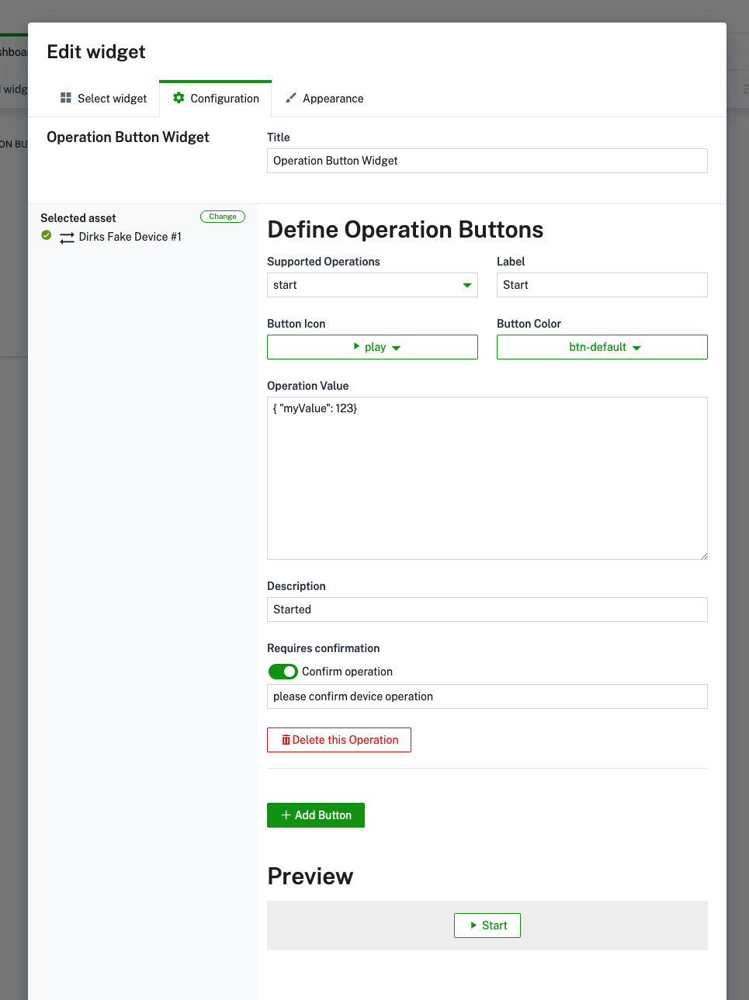

# Cumulocity Operations Widget

The Operations Widget enables Cumulocity IoT users to send predefined or custom operations from the Cockpit application.
Once you have selected the widget within the widget gallery you will find the widget configuration menu. There you can define multiple buttons, which make defined operations triggerable from inside the widget.
For each added button you can configure different parameters of the operation and the style of the buttons.

## Prequisites

    Cumulocity UI > 10.18

## Parameters to configure

| Field              | Description                                                            |
| ------------------ | ---------------------------------------------------------------------- |
| Title              | Title of the widget.                                                   |
| Label              | The label of the button.                                               |
| Description        | Description of the operation, which should be triggered by the button. |
| Operation Fragment | The operation fragment, which should be sent.                          |
| Operation Value    | The operation JSON object.                                             |
| Button             | The button type (color).                                               |
| Icon               | The button icon.                                                       |

When all buttons are configured, you can hit "Save" and find the buttons within the widget.

---
